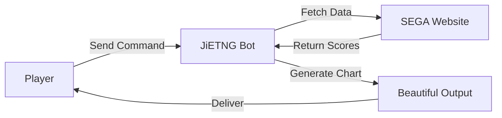

# Introduction

JiETNG is a comprehensive score management bot for Maimai DX, designed to help players track their progress, analyze their performance, and connect with the community.

## What is JiETNG?

JiETNG is a free, feature-rich bot available on LINE that automatically tracks and manages your Maimai DX scores. It fetches your play data directly from the official SEGA website and presents it in beautiful, easy-to-understand visualizations.

## Key Features

### 📊 Score Tracking

- **Best 50**: Generate comprehensive charts of your top scores
- **Real-time Updates**: Sync your latest plays with a single command
- **Historical Data**: Track your progress over time
- **Accurate Calculations**: Official-standard rating calculations

### 🔍 Powerful Search

- **Song Search**: Find any song by name or abbreviation
- **Advanced Filters**: Filter by level, rating, achievement, and more
- **Score Details**: View detailed information for each play

### 👥 Social Features

- **Friend System**: Connect with other players
- **Score Comparison**: Compare your scores with friends
- **Friend Requests**: Easy QR code-based friend adding
- **Leaderboards**: See how you rank among friends

### 📈 Analysis Tools

- **Plate Progress**: Track your progress towards plate completions
- **Level Analysis**: View all your scores for a specific level
- **Version Stats**: See your performance across different versions

## Why Choose JiETNG?

### For Casual Players

- **Simple Commands**: Easy-to-use interface for checking scores
- **Visual Charts**: Beautiful graphics that make data easy to understand
- **Quick Updates**: Sync your scores in seconds
- **Mobile-Friendly**: Works perfectly on your phone

### For Competitive Players

- **Detailed Analytics**: In-depth analysis of your performance
- **Rating Tracking**: Monitor your rating changes over time
- **Goal Setting**: Track progress towards specific achievements
- **Friend Competition**: Compare scores with rivals

### For Community Organizers

- **Friend Features**: Manage groups of players
- **Score Sharing**: Easy sharing of achievements
- **Multilingual**: Support for Japanese, English, and Chinese

## How It Works

1. **You send a command** to JiETNG (e.g., `b50`)
2. **JiETNG fetches your data** from the official SEGA website
3. **Data is processed** and analyzed
4. **Beautiful charts are generated** and sent to you

## Platform Support

### LINE

- Native Japanese user base
- FlexMessage for rich UI
- QuickReply for easy navigation
- Official LINE Bot features
- Multi-language support (Japanese, English, Chinese)

## Security & Privacy

Your data security is paramount:

- ✅ **Encrypted Storage**: All credentials are encrypted
- ✅ **No Third-Party Access**: Your data stays private
- ✅ **Transparent**: Open development process
- ✅ **User Control**: Delete your data anytime

[Read our Privacy Policy →](/more/privacy)

## Technology Stack

JiETNG is built with modern, reliable technologies:

- **Backend**: Python 3.11+ with Flask
- **Messaging**: python-line-bot-sdk
- **Data Storage**: Encrypted JSON databases
- **Image Generation**: Pillow (PIL)
- **Web Scraping**: BeautifulSoup4, lxml

## Open Development

While JiETNG's source code is proprietary, development is transparent:

- 📢 Regular updates and announcements
- 🐛 Public issue tracking
- 💡 Feature requests from users
- 📖 Comprehensive documentation

## Community

Join thousands of Maimai DX players using JiETNG:

- 🌏 Players from Japan, Asia, and worldwide
- 💬 Active community discussions
- 🎯 Regular events and competitions
- 🤝 Helpful and friendly atmosphere

## Getting Started

Ready to start tracking your scores?

[Quick Start Guide →](/guide/getting-started)

## Support the Project

JiETNG is free to use and maintained by a single developer. If you find it useful, consider supporting its development:

[Learn how to support →](/more/support)

---

Have questions? Check our [FAQ](/more/faq) or [contact us](/more/support).
