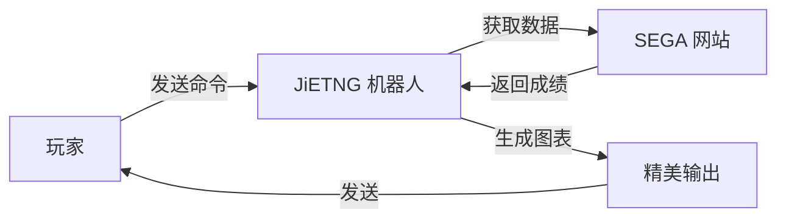

# 介绍

JiETNG 是一个全面的 maimai DX 成绩管理机器人，旨在帮助玩家追踪进度、分析表现并与社区建立联系。

## 什么是 JiETNG？

JiETNG（发音"jie ting"）是一个免费、功能丰富的机器人，可在 LINE 上使用，可自动追踪和管理您的 maimai DX 成绩。它直接从官方 SEGA 网站获取您的游玩数据，并以精美、易于理解的可视化方式呈现。

## 核心功能

### 📊 成绩追踪

- **Best 50**: 生成您最佳成绩的综合图表
- **实时更新**: 使用单个命令同步最新游玩记录
- **历史数据**: 追踪您随时间的进步
- **精确计算**: 符合官方标准的 rating 计算

### 🔍 强大搜索

- **曲目搜索**: 按名称或缩写查找任何曲目
- **高级过滤**: 按等级、rating、达成率等过滤
- **成绩详情**: 查看每次游玩的详细信息

### 👥 社交功能

- **好友系统**: 与其他玩家建立联系
- **成绩对比**: 与好友比较成绩
- **好友申请**: 基于二维码的简便好友添加
- **排行榜**: 查看您在好友中的排名

### 📈 分析工具

- **牌子进度**: 追踪您完成牌子的进度
- **等级分析**: 查看特定等级的所有成绩
- **版本统计**: 查看您在不同版本中的表现

## 为什么选择 JiETNG？

### 休闲玩家

- **简单命令**: 易于使用的查询成绩界面
- **可视化图表**: 精美的图形使数据易于理解
- **快速更新**: 几秒内同步您的成绩
- **移动友好**: 在手机上完美运行

### 竞技玩家

- **详细分析**: 深入分析您的表现
- **Rating 追踪**: 监控您的 rating 随时间的变化
- **目标设定**: 追踪特定成就的进度
- **好友竞争**: 与对手比较成绩

### 社区组织者

- **好友功能**: 管理玩家群组
- **成绩分享**: 轻松分享成就
- **多语言**: 支持日语、英语和中文

## 工作原理

1. **您发送命令**给 JiETNG（例如 `b50`）
2. **JiETNG 从官方 SEGA 网站获取**您的数据
3. **数据被处理**和分析
4. **生成精美图表**并发送给您

## 平台支持

### LINE

- 日本本地用户群
- FlexMessage 提供丰富 UI
- QuickReply 便于导航
- 官方 LINE Bot 功能
- 多语言支持（日语、英语、中文）

## 安全与隐私

您的数据安全至关重要：

- ✅ **加密存储**: 所有凭据均已加密
- ✅ **无第三方访问**: 您的数据保持私密
- ✅ **透明**: 公开的开发过程
- ✅ **用户控制**: 随时删除您的数据

[阅读我们的隐私政策 →](/zh/more/privacy)

## 技术栈

JiETNG 使用现代、可靠的技术构建：

- **后端**: Python 3.11+ 配合 Flask
- **消息平台**: python-line-bot-sdk
- **数据存储**: 加密的 JSON 数据库
- **图像生成**: Pillow (PIL)
- **网页抓取**: BeautifulSoup4, lxml

## 开放开发

虽然 JiETNG 的源代码是专有的，但开发过程是透明的：

- 📢 定期更新和公告
- 🐛 公开问题追踪
- 💡 来自用户的功能请求
- 📖 全面的文档

## 社区

加入数千名使用 JiETNG 的 maimai DX 玩家：

- 🌏 来自日本、亚洲和世界各地的玩家
- 💬 活跃的社区讨论
- 🎯 定期活动和比赛
- 🤝 友好热情的氛围

## 开始使用

准备好开始追踪您的成绩了吗？

[快速开始指南 →](/zh/guide/getting-started)

## 支持项目

JiETNG 免费使用，由单个开发者维护。如果您觉得它有用，请考虑支持其开发：

[了解如何支持 →](/zh/more/support)

---

有问题？查看我们的 [FAQ](/zh/more/faq) 或[联系我们](/zh/more/support)。
